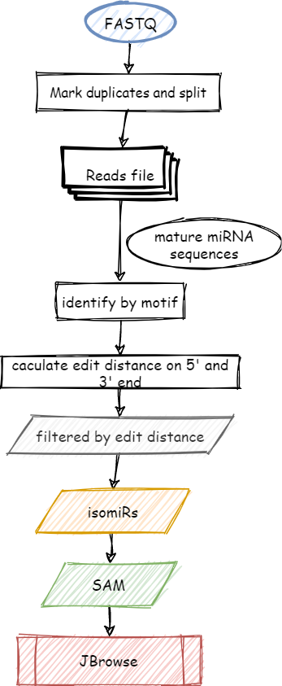
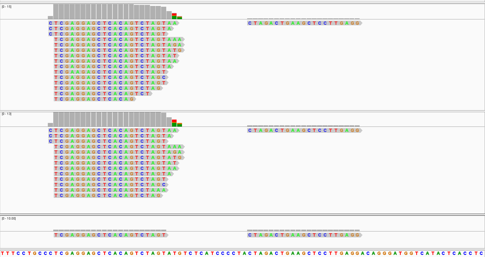

# IsoMir: A Pipeline for Detection of isomiRs

IsomiRs are isoforms of the same canonical mature miRNA with alternative length and/or sequence variants.
Growing body of evidence suggested that some isomiRs appear biologically relevant.

This pipeline is designed to organize functions for detecting isomiRs from miRseq data with a Workflow Description Language (WDL) ([version 1.0](https://github.com/openwdl/wdl/blob/main/versions/1.0/SPEC.md#workflow-description-language)).

The algorithm was borrowed from QuagmiR <https://github.com/Gu-Lab-RBL-NCI/QuagmiR> with some changes:

* We implement the algorithm with **C++**, which make it run faster.
* The workflow was controlled by **WDL**.
* The input reads can be splitted and **parallelly processed** in WDL.
* Add some helper functions, including **visualization**.
* (Optional) Beside the algorithm from QuagmiR, we align the short reads to pri-miRNA from  miRBase (Release 22.1) directly with Smith–Waterman algorithm.

Particularly, this pipeline could be adapted to analyze the kinetics of chimeric miRNA-siRNA, for example the miHTT design in pre-miR-451 backbone (Cells. 2022; 11(17): 2748), and the siHTT design in pre-miR-155 backbone (Brain. 2021; 144(11): 3421–3435). 


## Code structure

```
.
├── data
│   ├── hsa_mibase.tsv
│   ├── hsa_mirna.sam
│   ├── hsa_mirna.tsv
│   ├── hsa_pre.fa
│   ├── mibase22.1.tsv
│   └── sample1.fastq
├── img
│   ├── igv.png
│   └── workflow.png
├── LICENSE
├── README.md
├── script
│   ├── align_pre.R
│   ├── isomir
│   ├── merge_hit.R
│   ├── merge_isoform.R
│   ├── process_mibase.R
│   ├── split_reads.R
│   └── util.R
├── src
│   ├── base.h
│   ├── code.h
│   ├── config.cpp
│   ├── config.h
│   ├── config.o
│   ├── detection.cpp
│   ├── detection.h
│   ├── detection.o
│   ├── isoform.h
│   ├── isomir
│   ├── levenshtein.cpp
│   ├── levenshtein.h
│   ├── levenshtein.o
│   ├── main.cpp
│   ├── main.o
│   ├── Makefile
│   └── mirna.h
└── wdl
    ├── input.json
    └── main.wdl
```

### script: all the R scripts and executable binary

### src: C++ source code implemented to find isomiRs

### wdl
  - input.json
  - main.wdl

### data  
The example data directory.
  
#### isoform.sam
Sequence Alignment Map (SAM) format file of reads located on pre-miRNA.

```
read4868	0	hsa-mir-151a	11	30	22M	*	0	0	TCGAGGAGCTCACAGTCTAGTA	*	RN:i:75	DT:i:1
read4867	0	hsa-mir-151a	11	30	21M	*	0	0	TCGAGGAGCTCACAGTCTAGT	*	RN:i:64	DT:i:0
read4869	0	hsa-mir-151a	11	30	23M	*	0	0	TCGAGGAGCTCACAGTCTAGTAA	*	RN:i:14	DT:i:2
```

In the SAM format, each alignment line represents the alignment of a short reads. 
Each line consists of 11 or more TAB-separated columns. 
For more details see <https://samtools.github.io/hts-specs/SAMv1.pdf>. 
Here we just list some import columns in this case.
  - Col. 1: read ids
  - Col. 3: pre-miRNA
  - Col. 4: 1-based leftmost mapping positon of the reads
  - Col. 6: CIGAR string, reprenting match, insertiong, deletion, et al. in an alignment.
  - Col. 10: sequence of the read
  - Optonal columns: `RN` means amonut of the read in raw sequencing FASTQ file; `ID` repesents identity/similarity of the local alignment between read and reference.

#### isoform_bam
The compressed binary veriosn of SAM (BAM) of `isoform.sam`.

#### hit.sam
SAM format file of reads located on pre-miRNA.
The mapping was implemented with Smith–Waterman algorithm.

#### hit_bam
The compressed binary veriosn of SAM (BAM) file of `hit.sam`.

#### mirna.sam and mirna.bam
SAM/BAM files of canonical miRNA.

`input.json` is the input file for [cromtool](https://github.com/broadinstitute/cromwell)

```json
{
  "isomir.script_dir": "/home/bc/isomir/script",
  "isomir.result_dir": "/home/bc/isomir/result",
  "isomir.mibase_file": "/home/bc/isomir/data/hsa_mibase.tsv",
  "isomir.fq_file": "/home/bc/isomir/data/sample1.fastq",
  "isomir.mirna_file": "/home/bc/isomir/data/hsa_mirna.tsv",
  "isomir.pre_file": "/home/bc/isomir/data/hsa_pre.fa",
  "isomir.mirna_sam_file": "/home/bc/isomir/data/hsa_mirna.sam",
  "isomir.max_edit_dist_5p": 2,
  "isomir.max_edit_dist_3p": 3,
  "isomir.min_identity": 0.9,
  "isomir.split_num": 10,
  "isomir.is_pre": false
}
```

* `max_edit_dist_5p` is the maximum distance between 5' part of reads with reference miRNA.
* `max_edit_dist_3p` is the maximum distance between 3' part of reads with reference miRNA.

## Preprocess

### miRNA.xls
Downlaod `miRNA.xls` from miRBase (Release 22.1) <https://mirbase.org/ftp/

### Identify unique motif for each miRNA
Each miRNA sequence is divided into three regions: 5' part, 3' part and a central region. 
The central region is referred to as the 'motif'. 
Reads matching a certain motif were considered as potential isomiRs for the corresponding miRNA.

```bash
cd isomir
Rscript script/process_mibase.R data/mibase22.1.tsv hsa 13 data
```

## Workflow



### Mark duplicates in the FASTQ file
To speed up the computation, we first extract sequences of each reads, and then mark and count duplicates. 
The sequence with its amount are stored in a tab-separated values (TSV) file.

### Split reads file
Split the reads file into multiple files, which can be scattered to parallelize the task of identifing isomiRs.

### Identify reads as certein miRNA based on the motif
Reads matching a certain motif were considered as potential isomiRs for the corresponding miRNA.

### Caculate edit distance of 5′ or 3′ ends
For the potential isomiR reads, the 5' part and 3' part (preced and follow the motif) sequences are further compared with reference miRNA respetively.
The pairwise sequence similarity between 5' part and 3' part with the reference miRNA is calculated using the Levenshtein distances (edit distances).
The maximum allowed edit distances for the 5' and 3' regions can be set 
independently to capture the asymmetrical sequence heterogeneity.

### Visualize 
The output of IsomiRs are stored as SAM/BAM format, which can be interactively visuallized by genomics viewer tools, such as [The Integrative Genomics Viewer (IGV)](https://software.broadinstitute.org/software/igv/)



## Installation

### Prerequisites

#### R

```bash
sudo apt update -qq
sudo apt install --no-install-recommends software-properties-common dirmngr
wget -qO- https://cloud.r-project.org/bin/linux/ubuntu/marutter_pubkey.asc | sudo tee -a /etc/apt/trusted.gpg.d/cran_ubuntu_key.asc
sudo add-apt-repository "deb https://cloud.r-project.org/bin/linux/ubuntu $(lsb_release -cs)-cran40/"

sudo apt install --no-install-recommends r-base
```

```r
# install R pacakges
install.packages(c("tidyverse"))

# Bioconductor
if (!require("BiocManager", quietly = TRUE))
    install.packages("BiocManager")
BiocManager::install("Biostrings")
```

#### samtools
```sh
wget https://github.com/samtools/samtools/releases/download/1.16.1/samtools-1.16.1.tar.bz2
tar xjvf samtools-1.16.1.tar.bz2
cd samtools-1.16.1
./configure
make
make install
```

#### cromwell and womtool
```sh
sudo apt install openjdk-17-jre-headless

wget https://github.com/broadinstitute/cromwell/releases/download/84/cromwell-84.jar
sudo mv cromwell-84.jar /opt/cromwell.jar

wget https://github.com/broadinstitute/cromwell/releases/download/84/womtool-84.jar
sudo mv womtool-84.jar /opt/womtool.jar
```

### compile isomir
Move to c++ source code directory and compile using:

```sh
cd isomir/src
make
```

The compiled binary is called `isomir`


## Usage
Set paramaters in `input.json` then run

```
cd isomir/wdl
java -jar /opt/cromwell.jar run main.wdl -i input.json
```
